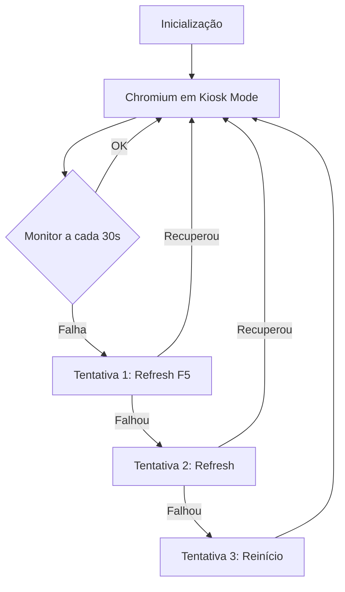

# Mint Kiosk - Sistema de Quiosque Digital para Linux Mint

Este script transforma o Linux Mint em um quiosque digital inteligente, ideal para murais de avisos, painéis informativos e aplicações PWA (Progressive Web Apps). O sistema é auto-gerenciável, com detecção inteligente de falhas e recuperação automática.

> Testado no Linux Mint 22.3

## Pré-requisitos

- Linux Mint 22.3 (ou superior) instalado
- Conexão com internet para instalação
- Usuário com privilégios sudo

## Instalação em Comando Único

```bash
sudo bash -c "$(wget -qO- https://raw.githubusercontent.com/ctic-tub-ifsc/mint-kiosk/refs/heads/main/install_kiosk.sh)"
```

> **Nota:** Durante a instalação, você precisará informar:
> - URL do site/mural a ser exibido
> - (Opcional) Configuração de acesso VNC com senha

## Funcionalidades Principais

### 1. **Exibição em Modo Quiosque**
- Chromium em tela cheia (kiosk mode)
- Sem barras de ferramentas ou infobars
- Sem protetor de tela ou suspensão automática
- Cursor do mouse oculto quando inativo

### 2. **Monitoramento Inteligente de Saúde**
- Verificação contínua do processo Chromium
- Detecção de janelas congeladas ou não responsivas
- Diagnóstico pós-falha com screenshots automáticos
- Suporte a PWA com cache offline preservado

### 3. **Recuperação Automática**
- **Refresh suave (F5)** ao primeiro sinal de problema
- **Reinicialização completa** após múltiplas falhas consecutivas
- **Detecção de conectividade** da URL alvo
- **Preservação do cache** para exibição offline

### 4. **Diagnóstico e Logs**
- Screenshots automáticos **APENAS quando ocorrem falhas**
- Logs detalhados em `/var/log/kiosk_monitor.log`
- Pacote de evidências para troubleshooting
- Limpeza automática de logs antigos

### 5. **Acesso Remoto (Opcional)**
- Servidor VNC integrado
- SSH ativado para administração
- Firewall configurado automaticamente

## Comandos Básicos de Verificação

Após a instalação, utilize estes comandos para verificar o funcionamento:

### Verificar Status do Serviço
```bash
# Status do serviço kiosk
sudo systemctl status kiosk.service

# Ver logs em tempo real
sudo journalctl -u kiosk.service -f

# Últimas 50 linhas do log
sudo journalctl -u kiosk.service -n 50 --no-pager
```

### Verificar Logs do Monitor
```bash
# Log principal do kiosk
sudo tail -f /var/log/kiosk_monitor.log

# Ver últimas falhas registradas
grep "ERRO" /var/log/kiosk_monitor.log | tail -20

# Ver screenshots de diagnóstico
ls -la /var/log/kiosk_screenshots/
```

### Comandos de Gerenciamento
```bash
# Reiniciar o serviço kiosk (sem reiniciar o sistema)
sudo systemctl restart kiosk.service

# Parar o serviço temporariamente
sudo systemctl stop kiosk.service

# Iniciar o serviço manualmente
sudo systemctl start kiosk.service

# Desabilitar o serviço (não inicia no boot)
sudo systemctl disable kiosk.service

# Reabilitar o serviço
sudo systemctl enable kiosk.service
```

### Verificar Acesso VNC (se configurado)
```bash
# Verificar se VNC está rodando
systemctl --user status vino-server

# Ver porta aberta
sudo netstat -tulpn | grep 5900
```

## Estrutura de Logs e Diagnóstico

```
/var/log/
├── kiosk_monitor.log          # Log principal do sistema
└── kiosk_screenshots/          # Screenshots de diagnóstico
    ├── diagnostic_20240101_103022_chromium_unhealthy.png
    ├── diagnostic_20240101_103022_chromium_unhealthy.log
    ├── diagnostic_20240101_103055_pre_restart.png
    └── diagnostic_20240101_103055_pre_restart.log
```

## Como o Monitor Inteligente Funciona

O sistema utiliza uma abordagem **reativa** (não proativa) para diagnóstico:

1. **Verificações leves a cada 30 segundos:**
   - Processo Chromium existe?
   - Janela está visível?
   - Janela aceita foco?

2. **Ao detectar falha:**
   - Captura screenshot do momento
   - Salva logs do sistema
   - Tenta refresh suave (F5)
   - Se persistir, reinicia o Chromium

3. **APÓS 3 falhas consecutivas:**
   - Reinicialização completa
   - Novo screenshot de diagnóstico
   - Limpeza de preferências corrompidas

## Resolução de Problemas

Para diagnósticos aprofundados, soluções para problemas comuns e guia de troubleshooting avançado, consulte nosso guia detalhado:

**[Guia de Resolução de Problemas](resolucao_de_problemas.md)**

O guia inclui:
- Análise de causas raízes
- Interpretação de logs e screenshots
- Problemas comuns e soluções
- Configurações avançadas
- Recuperação de emergência

## O que o Script Configura Automaticamente

1. **Sistema Base**
   - Atualização de pacotes
   - Instalação de dependências (unclutter, xdotool, curl, etc.)
   - Configurações de energia e tela
   - Remoção de protetor de tela

2. **Chromium**
   - Instalação da versão mais recente
   - Configuração de perfil persistente para PWA
   - Cache offline habilitado
   - Parâmetros otimizados para kiosk

3. **Serviço Systemd**
   - Criação do serviço `/etc/systemd/system/kiosk.service`
   - Inicialização automática no boot
   - Política de restart inteligente

4. **Monitor Inteligente**
   - Script de monitoramento em `/home/usuario/kiosk/kiosk.sh`
   - Detecção de falhas e recuperação automática
   - Sistema de logs e screenshots

5. **Acesso Remoto (opcional)**
   - Servidor VNC (vino)
   - SSH server
   - Firewall (UFW) configurado

## Ciclo de Vida do Serviço



## Notas Importantes

- **Screenshots** são gerados **APENAS em momentos de falha** para diagnóstico
- O sistema **NÃO** faz refresh automático periódico (evita flickering)
- PWAs mantêm cache offline normalmente
- Máximo de 10 screenshots são mantidos (limpeza automática)
- Logs são automaticamente truncados quando atingem 1000 linhas

## Contribuição

Para sugestões, problemas ou melhorias, abra uma issue no repositório ou entre em contato com a equipe CTIC.

---
**CTIC - Campus Tubarão**  
Instituto Federal de Santa Catarina
